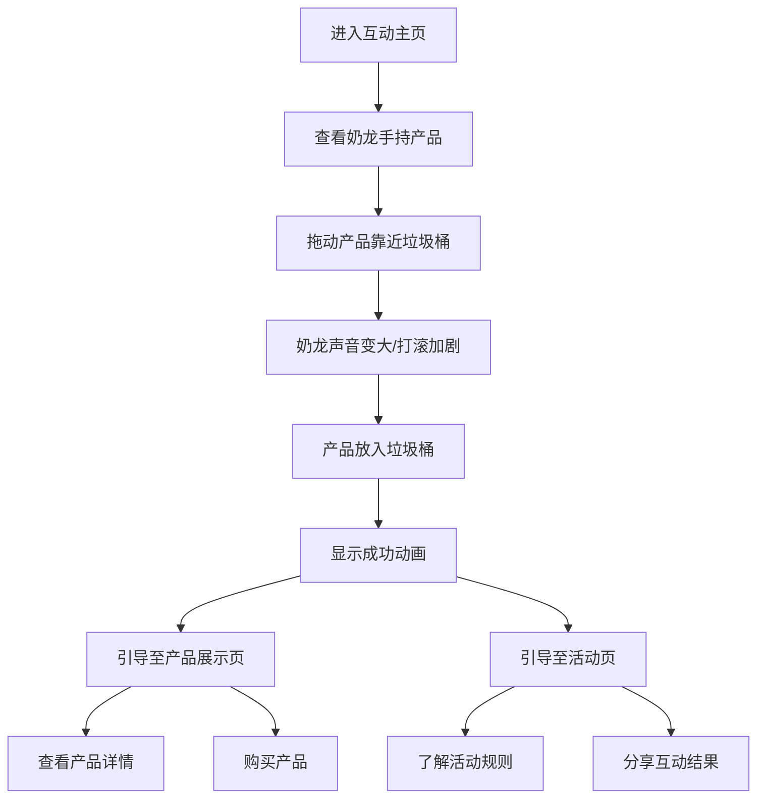

## 1. Product Overview
周黑鸭与奶龙IP联动的互动营销页面，通过趣味互动增强品牌认知和用户参与度。
- 主要目的是通过有趣的互动体验提升品牌曝光度，吸引年轻用户群体
- 目标是成为社交媒体分享热点，增加产品销量和品牌好感度

## 2. Core Features

### 2.1 User Roles
| Role | Registration Method | Core Permissions |
|------|---------------------|------------------|
| Visitor | No registration required | Access all interactive features |

### 2.2 Feature Module
1. **互动主页**：奶龙与周黑鸭产品互动场景，滑动垃圾桶功能
2. **产品展示页**：联动产品详情，购买入口
3. **活动页**：联动活动规则，参与方式

### 2.3 Page Details
| Page Name | Module Name | Feature description |
|-----------|-------------|---------------------|
| 互动主页 | 奶龙互动区域 | 奶龙手持周黑鸭产品，可拖动产品靠近垃圾桶，距离越近奶龙反应越强烈 |
| 互动主页 | 声音反馈系统 | 根据产品与垃圾桶的距离，调整奶龙声音的音量和频率 |
| 互动主页 | 动画反馈系统 | 根据产品与垃圾桶的距离，调整奶龙打滚的幅度和频率 |
| 互动主页 | 垃圾桶区域 | 边缘放置垃圾桶，接收拖动的产品 |
| 产品展示页 | 产品详情 | 展示联动产品的图片、价格、特色 |
| 产品展示页 | 购买入口 | 提供产品购买链接或二维码 |
| 活动页 | 活动规则 | 说明联动活动的参与方式和奖励 |
| 活动页 | 分享功能 | 允许用户分享互动结果到社交媒体 |

## 3. Core Process
用户进入互动主页，看到奶龙手持周黑鸭产品，通过鼠标或触摸拖动产品向垃圾桶方向移动。随着距离缩短，奶龙会发出更大的声音并更激烈地打滚。当产品被拖入垃圾桶后，页面会显示成功动画并引导用户查看产品详情或参与活动。

## 4. User Interface Design
### 4.1 Design Style
- 主色调：周黑鸭红色 (#E60012) + 奶龙黄色 (#FFD700) + 白色 (#FFFFFF)
- 按钮风格：圆润可爱，符合奶龙形象，带有轻微3D效果
- 字体：卡通风格字体，标题使用粗体，正文使用清晰易读的字体
- 布局风格：居中布局，上方为互动区域，下方为导航和信息区域
- 图标/表情风格：使用奶龙的可爱表情和周黑鸭的品牌元素

### 4.2 Page Design Overview
| Page Name | Module Name | UI Elements |
|-----------|-------------|-------------|
| 互动主页 | 奶龙互动区域 | 奶龙形象居中，手持周黑鸭产品，背景为简洁的卡通风格场景，产品可拖动，垃圾桶位于右侧边缘 |
| 互动主页 | 声音反馈系统 | 音量指示器，随距离变化的声音波形动画 |
| 互动主页 | 动画反馈系统 | 奶龙打滚动画，幅度和频率随距离变化 |
| 产品展示页 | 产品详情 | 产品图片轮播，价格标签，特色描述，购买按钮 |
| 活动页 | 活动规则 | 规则说明文本，参与按钮，分享按钮 |

### 4.3 Responsiveness
- 桌面端优先设计，同时支持移动端自适应
- 移动端优化触摸交互，确保拖动操作流畅
- 不同屏幕尺寸下保持互动体验的一致性

### 4.4 3D Scene Guidance
- 环境：明亮、欢快的卡通风格场景，背景为简单的室内或户外环境
- 光照：柔和的漫射光，突出奶龙和产品的色彩
- 相机：固定视角，聚焦在奶龙和产品上
- 构图：奶龙位于画面中央，垃圾桶位于右侧边缘
- 交互：产品拖动时的平滑动画，奶龙的响应式动画
- 后处理：轻微的卡通风格滤镜，增强视觉效果
- 资产：奶龙3D模型，周黑鸭产品模型，垃圾桶模型