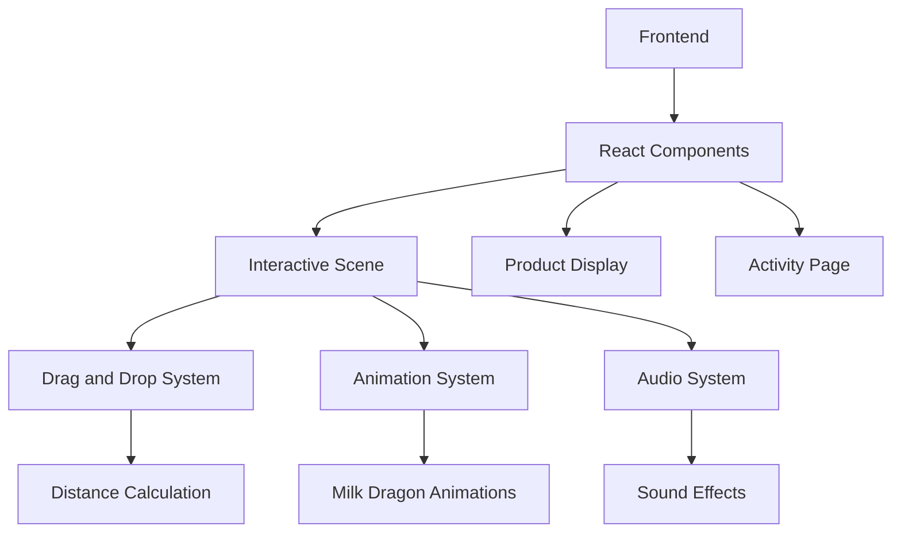

## 1. Architecture Design

## 2. Technology Description
- Frontend: React@18 + tailwindcss@3 + vite
- Initialization Tool: vite-init
- Backend: None (纯前端实现)
- Database: None
- Additional Libraries:
  - react-draggable: 实现产品拖动功能
  - howler.js: 实现声音效果
  - framer-motion: 实现流畅的动画效果

## 3. Route Definitions
| Route | Purpose |
|-------|---------|
| / | 互动主页，奶龙与产品互动场景 |
| /products | 产品展示页，联动产品详情 |
| /activity | 活动页，联动活动规则 |

## 4. API Definitions
无后端API，所有功能均在前端实现

## 5. Server Architecture Diagram
无后端服务器架构

## 6. Data Model
无数据模型，所有状态均在前端管理

## 7. Implementation Details
### 7.1 互动主页实现
- 使用react-draggable实现产品的拖动功能
- 实时计算产品与垃圾桶的距离
- 根据距离调整奶龙的动画幅度和频率
- 根据距离调整声音的音量和频率
- 当产品拖入垃圾桶时触发成功动画

### 7.2 动画系统
- 使用framer-motion实现奶龙的打滚动画
- 动画参数（幅度、频率）根据距离动态调整
- 产品拖动时的平滑动画效果

### 7.3 声音系统
- 使用howler.js管理声音效果
- 预加载奶龙的声音资源
- 根据距离动态调整音量和播放频率

### 7.4 响应式设计
- 使用tailwindcss实现响应式布局
- 针对不同屏幕尺寸优化交互体验
- 移动端触摸事件处理

### 7.5 性能优化
- 图片和音频资源的懒加载
- 动画性能优化，避免卡顿
- 响应式资源加载，根据设备性能调整效果